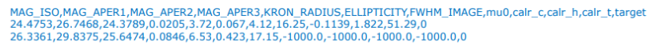

[Home](Readme.md)
# CSV
Comma-separated values (CSV) è un format di tipo testuale usato per importare e esportare dati tabulari. Non c'è nessuno standard che lo definisce, ma solamente pratiche più o meno consolidate. In questo formato ogni riga della tabella è definita da una riga di testo mentre le singole entrate della riga sono separate da una virgola.

