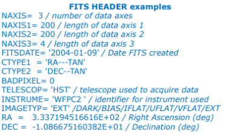
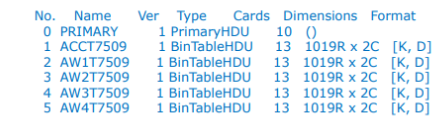

[Home](Readme.md)
# Fits
FITS (Flexible Image Transport System) è un formato usato per conservare, trasmettere e manipolare immagini scientifiche ad alta risoluzione. FITS è il formato più utilizzato in astronomia, disegnato specificamente per i dati scintifici. I [metadata](METADATA.md) nel formato FITS sono contenuti nel suo Header. Nel Header sono contenute informazioni fotometrice, callibarazioni spaziali, dati astronometrici, seeing, condizioni atmosferiche, strumenti utilizzati ecc..

I file FITS, possono contenere più di un immagine come mostrato in figura

Ma oltre alle immagini possono contenere anche altri tipi di dati, come catologhi, serie temporali ecc..
