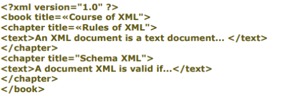

[Home](Readme.md)
# METADATA - XML
I metadata (dal greco 'meta' oltre e dal latino data 'informazioni') sono le informazioni che vengono date sui dati.

L'XML è un linguaggio che permette di strutturare i tuoi dati traimite tag. Di seguito un esempio di file XML che contiene la struttura di un libro 

  
